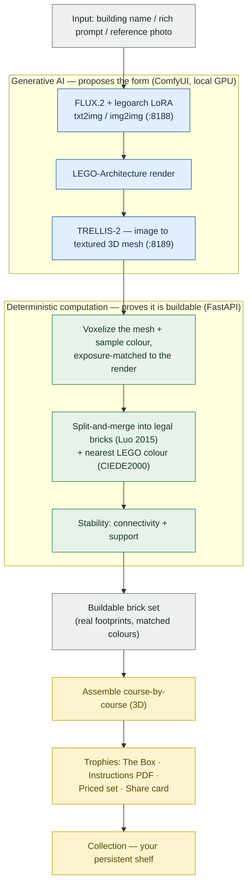
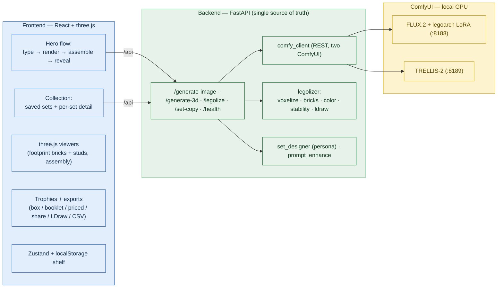
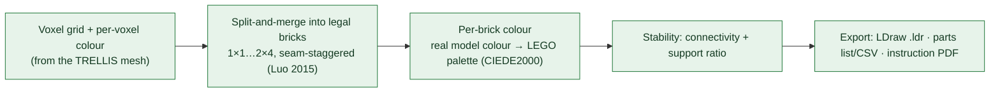
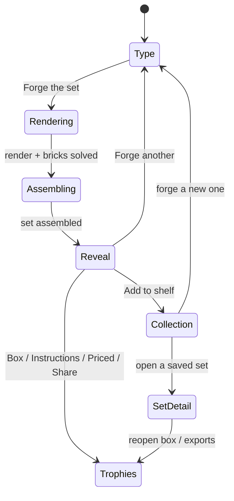

# lEgoarCh — flow & architecture

Diagrams render automatically on GitHub and in any Mermaid viewer.

> **The thesis in one line:** *Generative AI proposes the form; deterministic computation proves it's buildable.*
> A prior course project stopped at generated **images**. lEgoarCh continues downstream to a real, legal, buildable brick set.

---

## 1. Pipeline & data flow (the headline)

One cinematic flow: name a building → render → reconstruct → **solve into legal bricks** → package as a product. The backend is the **single source of truth** for the brick layout.

The smooth TRELLIS mesh is an **internal step**, not the product — the studded, discrete, buildable set is the output. (The mesh/voxel grid is what makes the bricks *match the building*.)

---

## 2. System architecture

The app requires the live backend + ComfyUI (no mock mode). The frontend renders whatever bricks the backend returns; it never invents geometry. A DEV-only "Preview the assembly" button loads one real bundled sample so the UI can be exercised without a GPU.

---

## 3. The custom legolizer (the computational core)

The original contribution — not a wrapper around an off-the-shelf converter. Lives in `backend/app/legolizer/`.

Outputs measurable, defensible metrics (not FID/CLIP): **% supported, connectivity (single component), piece count, parts list** — structural-plausibility evidence. Every emitted part is a real BrickLink id (`3001` 2×4, `3004` 1×2, `3003` 2×2, `3622` 1×3, `3010` 1×4, `3002` 2×3, `3005` 1×1).

---

## 4. User journey

**Feature summary**
- **Hero flow** — type → FLUX render → course-by-course assembly → reveal.
- **Set designer** — auto-names the set and writes box copy (Claude if keyed, else templates).
- **Trophies** — The Box (art), Instruction booklet (PDF), Priced set (estimate + BrickLink link), Share card.
- **Collection** — persistent shelf; reopen any set with live 3D + trophies + LDraw/CSV.
- **Fun layer** — felt "build table", BrickBuddy mascot, snap/pop sounds (mute in the header), LEGO-grounded visual system (see `design-system.md`), trademark-safe.
