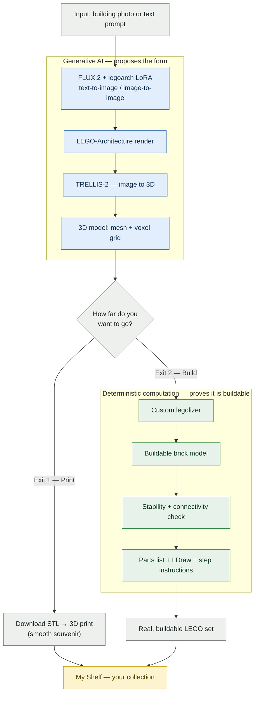
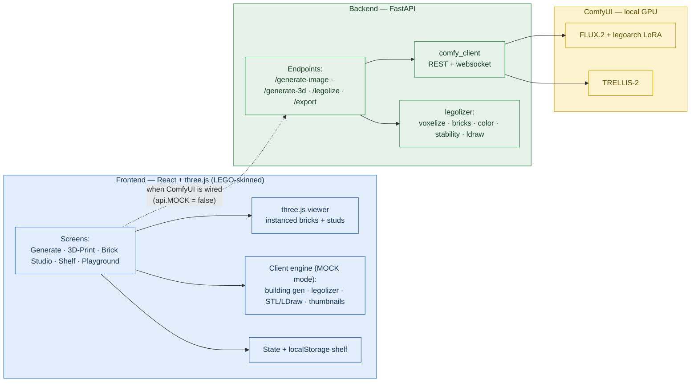
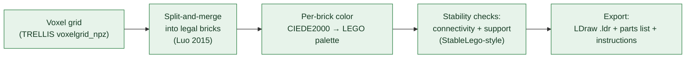
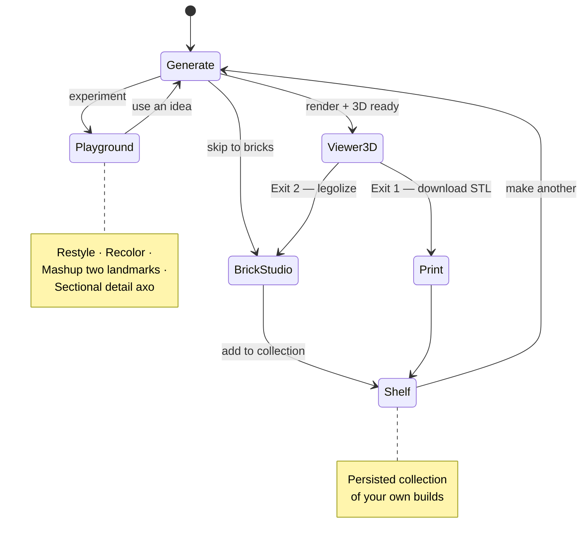

# lEgoarCh — concept, flow & architecture

Diagrams for presenting the project. They render automatically on GitHub and in any Mermaid viewer.

> **The thesis in one line:** *Generative AI proposes the form; deterministic computation proves it's buildable.*
> A prior course project stopped at generated **images**. lEgoarCh continues downstream to a thing you can **hold** — 3D-printed *or* genuinely built from bricks.

---

## 1. Concept & data flow (the headline)

One pipeline, **two exits**, the user chooses how far to go.

**Why the two exits matter:** the original worry — *"a 3D-printed smooth mesh loses the LEGO feel"* — is resolved by making the print **Exit 1** (optional) and the discrete, studded, buildable set **Exit 2**. The studs that "ruin" printing are exactly what make the set buildable.

---

## 2. System architecture (frontend / backend / ComfyUI)

**Status today:** the frontend runs entirely on the **client engine** (mock mode) — so the whole experience is clickable without a GPU. Only the two AI steps are mocked; everything downstream (bricks, stability, exports, shelf) is real. Flipping `api.MOCK = false` routes the same UI through FastAPI → ComfyUI.

---

## 3. The custom legolizer (the computational core)

This is the original contribution — not a wrapper around an off-the-shelf converter.

Outputs measurable, defensible metrics (not FID/CLIP): **% supported, connectivity (single component), brick count, parts list** — the kind of structural-plausibility evidence faculty reward.

---

## 4. User journey & features

**Feature summary**
- **Generate** — prompt/photo → legoarch render + live 3D geometry.
- **3D · Print (Exit 1)** — smooth print preview + real STL export.
- **Brick Studio (Exit 2)** — studded brick model, stability badges, parts list, LDraw/CSV/instructions.
- **My Shelf** — persistent collection of your builds (the "collector" hook).
- **Playground** — restyle, recolor, mashup, planned sectional-axo detail.
- **Fun layer** — LEGO-grounded visual system (see `design-system.md`), trademark-safe.
