# lEgoarCh — Generation benchmarks

**Date:** 2026-06-15 · **GPU:** NVIDIA GeForce RTX 4090 Laptop (16 GB)
**ComfyUI:** FLUX image (:8188) / TRELLIS 3D (:8189)

Every axis below is measured on the **same three example buildings**, so each
result is directly comparable across the pipeline:

- **Sagrada Família** — fame + the real LEGO set #21065; fused openwork towers.
- **La Muralla Roja** — the colour-led case (dark red / coral / lavender).
- **Guggenheim Bilbao** — the **honest boundary**: Gehry's freeform curves
  reconstruct as a recognizable-but-abstract metallic blob.

Every output carries its full recipe: each forge writes a sibling `.json`
(model, prompt, seed, every parameter) in
[benchmarks/assets/examples/](benchmarks/assets/examples/), produced by
`scripts/bench_buildings.py` / `bench_seed.py` (GPU) and analysed offline by
`bench_axes.py` / `bench_figures.py`, all driving the production code path.

## 1. Fixed configuration

| Component | Value |
|---|---|
| Image model | `flux-2-klein-base-4b-fp8` (FLUX.2 Klein 4B, **base/undistilled** — real CFG, negative prompts active) |
| Text encoder / VAE | `qwen_3_4b_fp8_mixed` / `flux2-vae` |
| LoRA | `FLUX.2/legoarch.safetensors` — custom fine-tune on LEGO Architecture set photography; trigger `legoarch` |
| Sampler / scheduler | `euler` + `Flux2Scheduler`, 1024×1024 |
| 3D model | TRELLIS.2-4B (visualbruno ComfyUI wrapper), background removal on, **fast preset** (ss 20 / shape 25 / tex 18, 40k decimation, 512 texture) |
| Voxelizer | trimesh, anisotropic plate-unit grid (8 mm stud / 3.2 mm plate), **solid fill**, default 32 studs on the longest horizontal axis |
| Legolizer | three-pass split-and-merge (bricks → plates → tiles) + slopes, CIEDE2000 colour, **Track-B colour denoise**, seam-stagger 1.0, randomness 0.12 |

## 2. Method

The three building prompts are the production example chips
([frontend/src/hero/examples.js](../frontend/src/hero/examples.js)), forged at
**fixed seed 1001** (seed 2002 used for the robustness check, §8). FLUX settings
are swept **one axis at a time**, the winner of each carried into the next; the
3D preset, fill, colour and scale axes are then measured on the resulting mesh.
Buildability is judged on the thesis metrics — **single connected component, %
supported, piece count, validated colours** — not FID/CLIP.

## 3. Generative — FLUX defaults (the A/B that chose them)

Each grid: rows = the three buildings, columns = the swept setting, **winner
ringed**. Negative prompt is possible only because Klein **base** is undistilled
(CFG > 1 is real).

**Steps — winner 28** (saturates early; 40 costs +40 % time for nothing the
pipeline can use):
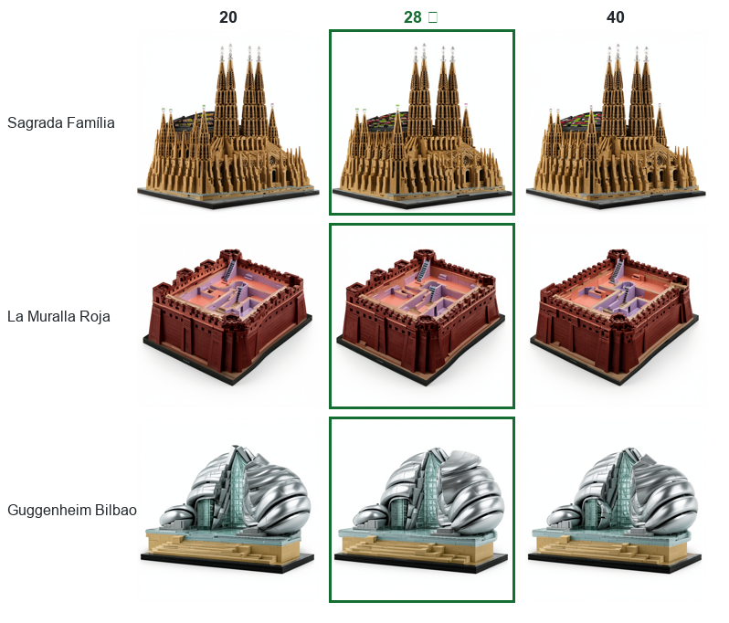

**CFG — winner 5.0** (sharpest massing + best-separated named colours, which the
CIEDE2000 matcher converts into more faithful brick palettes):
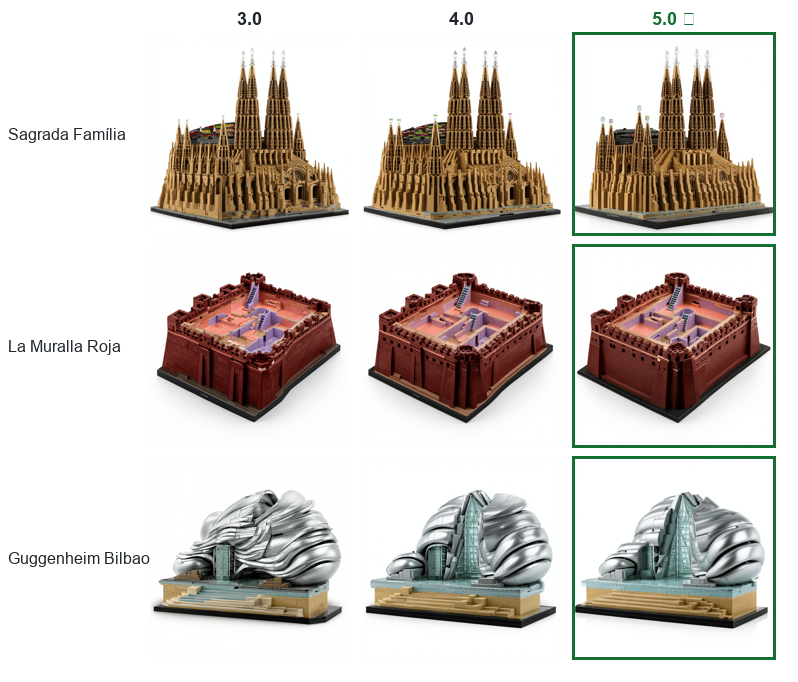

**LoRA strength — winner 1.0** (at 0.75 studs/seams fade — the LEGO-ness lives in
the LoRA):
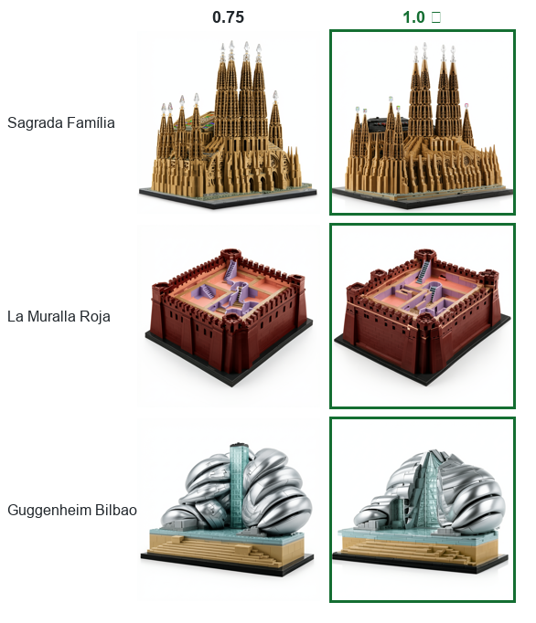

**Negative prompt — winner on** (chunkier single-mass massing — the best input
for image-to-3D):
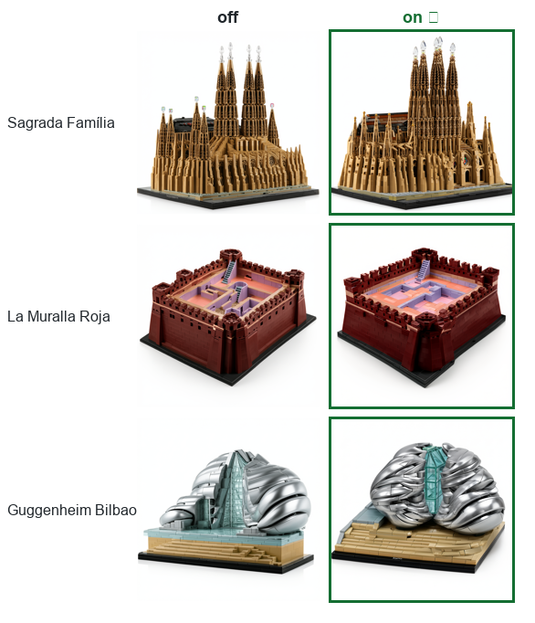

Negative: `people, trees, cars, vehicles, text, watermark, photograph of real
building, landscape, cluttered background, thin spires, antennas`.

**Locked defaults: steps 28 · CFG 5.0 · LoRA 1.0 · negative on.**

## 4. Generative outcome — the three buildings, end to end

The winning config forged through the full pipeline
(render → TRELLIS mesh → voxel colour → bricks). Montage panels:
**render | TRELLIS voxel colour | exposure-matched | brick build**.

| Building | render | pieces (detail 32) | colours | connected | support |
|---|---|---|---|---|---|
| Sagrada Família | ✅ instantly recognizable | 4,682 | 21 | ✓ | 0.95 |
| La Muralla Roja | ✅ recognizable | 7,343 | 19 | ✓ | 0.95 |
| Guggenheim Bilbao | ⚠️ **honest boundary** | 5,830 | 15 | ✓ | 0.93 |

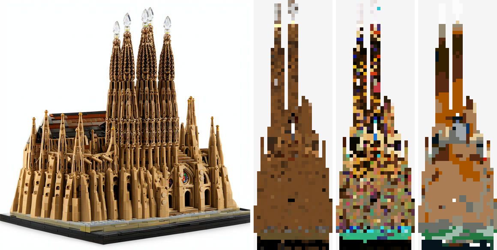
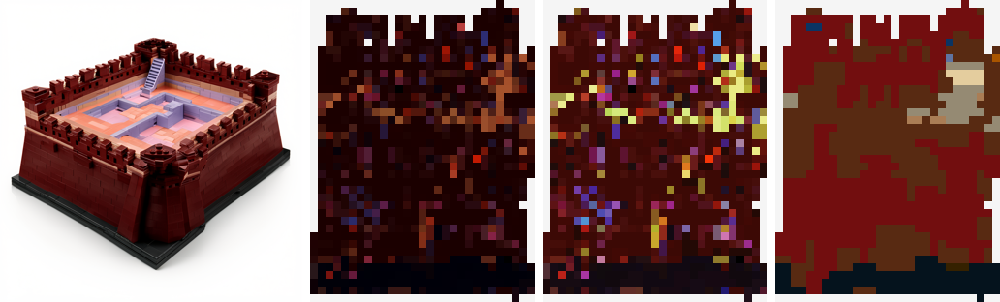
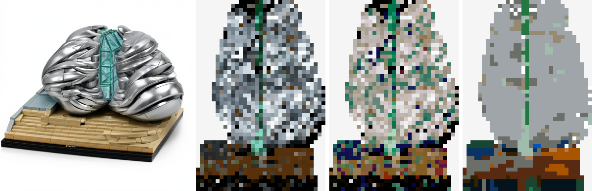

**Bilbao is kept on purpose.** Its render is striking but abstract and its build
is a metallic-grey mass with a green atrium stripe — *recognizable as a blob, not
as Bilbao*. Smooth, curvature-dominated forms are the **predicted boundary** of
voxel-based legolization: structurally sound (connected, 93 % supported) but not
legible. Showing it demonstrates we know where the method ends — and the
Sagrada/Muralla cases show where it works.

## 5. Computation — colour consistency (Track B denoise)

TRELLIS bakes high-frequency **chroma speckle** that survives exposure-matching;
because the packer forces a seam at every palette-code change, that speckle
shatters the build into a 1×1 confetti. A masked spatial blur (`rgb_blur_iters=1`)
before quantization dilutes isolated specks onto the local dominant — the render's
true colour — while coherent regions survive. The win is read off **M3/shatter**
(piece & colour counts); **M1** (perceptual palette-share, CIEDE2000 kernel) is a
floor confirming colours don't drift wrong. Method:
[scripts/replay_color.py](../scripts/replay_color.py) +
[metrics.py](../backend/app/legolizer/metrics.py).

| Building | strict quantize | denoised default | Δ pieces | Δ colours | M1 (floor) |
|---|---|---|---|---|---|
| Sagrada Família | 8,627 pc / 20 col | **4,682 pc / 21 col** | **−46 %** | +1 | 0.81 → 0.82 |
| Guggenheim Bilbao | 8,168 pc / 16 col | **5,830 pc / 15 col** | **−29 %** | −1 | 0.78 → 0.80 |
| La Muralla Roja | 9,043 pc / 21 col | **7,343 pc / 19 col** | **−19 %** | −2 | 0.93 → 0.89 |

"strict" = `rgb_blur 0 / smooth 1 / merge_tol 0`; "default" =
`rgb_blur 1 / smooth 2 / merge_tol 15`. The denoise cuts **19–46 % of pieces**
with **no loss of connectivity or support** and M1 held within ~0.04 (no colour
regression). Before/after elevations (top = strict confetti, bottom = denoised):

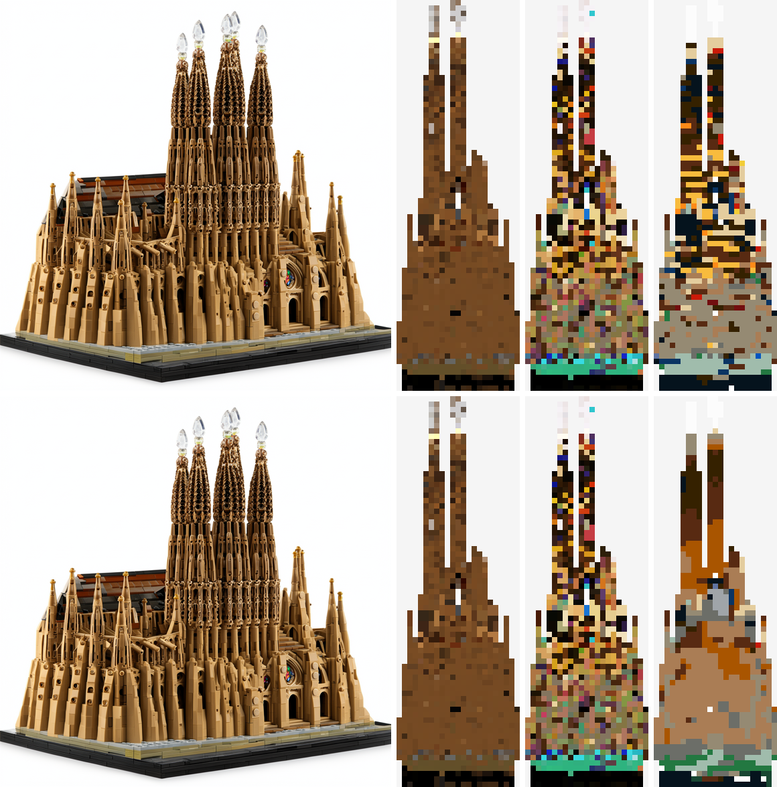
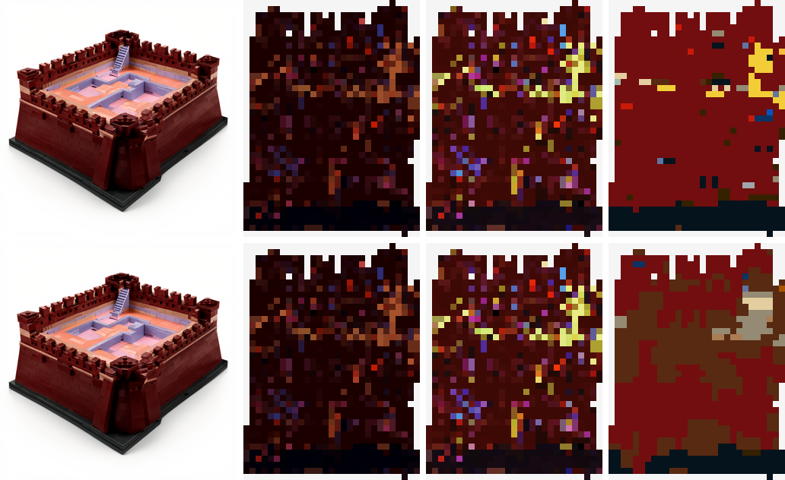

Muralla is the hardest case (genuinely multicolour → least to merge, −19 %) and
still cleans up without washing the red/coral/lavender story.

## 6. Computation — fill / void (buildability robustness)

The voxelizer fills the reconstruction **solid** by default. Comparison of the
raw hollow `surface` voxelization vs the `solid` fill, per building:

| Building | hollow (surface) | solid (fill) | Δ pieces | connected (both) |
|---|---|---|---|---|
| Sagrada Família | 4,859 ✓ | 4,682 ✓ | −3.6 % | ✓ → ✓ |
| Guggenheim Bilbao | 5,858 ✓ | 5,830 ✓ | −0.5 % | ✓ → ✓ |
| La Muralla Roja | 6,916 ✓ | 7,343 ✓ | +6.2 % | ✓ → ✓ |

**All three reconstruct as a single connected, ~93–95 %-supported mass with or
without fill** — these are well-formed massings, so fill is near piece-neutral
and connectivity is never at risk. Fill stays **on by default** as a guarantee:
it is the connectivity safety net for pathological *hollow-shell* reconstructions
(thin offset volumes that would otherwise sever), where its effect is large; on
solid massings like these it is a harmless no-op. Exterior-connected voids
(courtyards, Muralla's interior) survive by construction (outside-air flood
fill); floating fragments are re-grounded by the Testuz-style repair pass.

## 7. Computation — scale (detail per set)

Voxel target sets the brick budget. Same mesh, three detail levels — pieces scale
~quadratically while the silhouette resolves from blocky to crisp:

| Building | detail 24 (small) | detail 32 (default) | detail 48 (large) |
|---|---|---|---|
| Sagrada Família | 2,189 | 4,682 | 15,089 |
| La Muralla Roja | 3,553 | 7,343 | 21,675 |
| Guggenheim Bilbao | 2,723 | 5,830 | 16,370 |

Build elevations at detail 24 | 32 | 48:

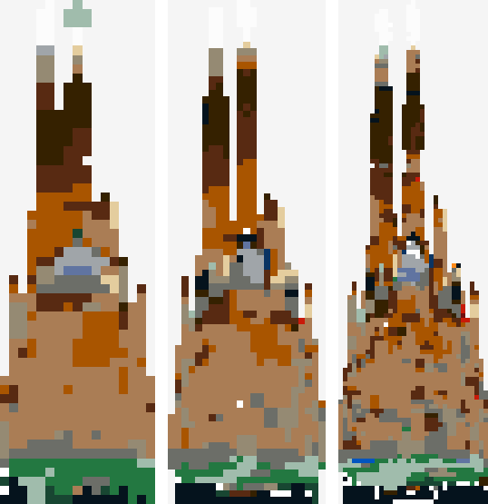
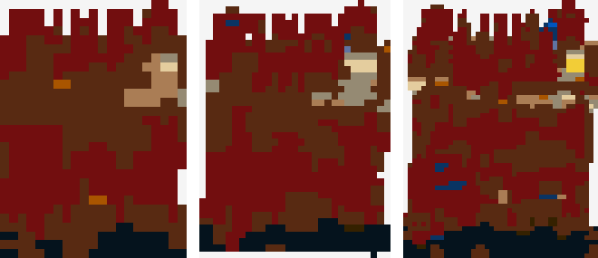
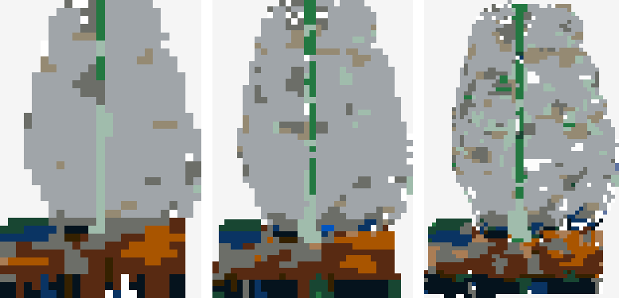

Detail 32 (4.7–7.3k pieces) is the default — a buildable set size; 48 reaches
15–22k (a flagship); 24 a quick 2–3.5k draft.

## 8. Robustness — seed consistency

The winning config re-forged at a second seed (2002) to confirm the output is
stable, not a single-seed fluke. Per building, seed 1001 vs 2002:

| Building | seed 1001 (pieces / support) | seed 2002 (pieces / support) | connected (both) | recognizable (both) |
|---|---|---|---|---|
| Sagrada Família | 4,682 / 0.95 | 3,051 / 0.94 | ✓ / ✓ | ✓ / ✓ |
| La Muralla Roja | 7,343 / 0.95 | 5,134 / 1.00 | ✓ / ✓ | ✓ / ✓ |
| Guggenheim Bilbao | 5,830 / 0.93 | 6,074 / 0.91 | ✓ / ✓ | ⚠ / ⚠ (blob, consistently) |

The right invariant is **buildability, not piece count.** A different seed is a
different generation — render, mesh and therefore part count naturally vary
(Sagrada 4.7k vs 3.0k) — but **both seeds yield a single connected, ~0.9–1.0
supported, recognizable set**, and Bilbao is *consistently* the same metallic
blob. The result is the method, not the seed. Per building, seed 1001 over 2002,
render → build:

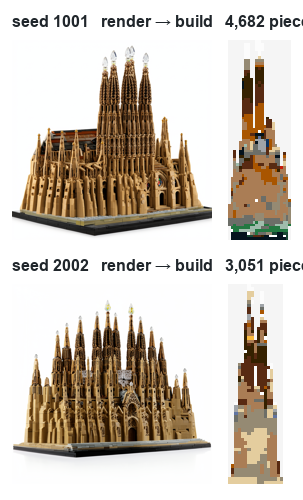
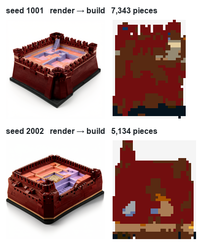
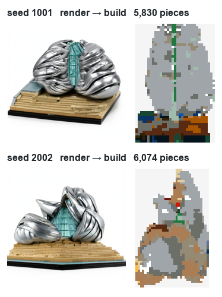

## 9. Final defaults

Env-overridable in [backend/app/comfy_client.py](../backend/app/comfy_client.py);
UI ranges in [frontend/src/hero/tinkerParams.js](../frontend/src/hero/tinkerParams.js).

| Parameter | Default | UI range |
|---|---|---|
| FLUX steps | 28 | 8–50 |
| FLUX CFG | 5.0 | 1–8 |
| LoRA strength | 1.0 | 0–1.5 |
| Negative prompt | on | not exposed |
| TRELLIS ss/shape/tex steps | 20 / 25 / 18 | shape 15–40 |
| TRELLIS shape guidance | 7.5 | 3–10 |
| TRELLIS max_tokens / decimation / texture | 49152 / 40k / 512 | env only |
| Voxel target (detail) | 32 studs | 16–64 |
| Voxel fill (solid core) | on (`fill=True`) | not exposed |
| Colour denoise `rgb_blur_iters` | 1 | 0–2 |
| Colour-code smoothing `smooth_iters` | 2 | 0–3 |
| Palette merge tol `merge_tol` (ΔE2000) | 15 | 0–30 |
| Legolizer randomness / seam weight | 0.12 / 1.0 | 0–0.5 / 0–2 |

## 10. Catalog & novelty (the rigor claims)

- **Real catalog.** Every emitted part is a real BrickLink/LDraw id, and every
  brick's colour is clamped to a colour that mould actually exists in
  (`elements.csv`), matched by CIEDE2000. Catalog from Rebrickable CSV dumps
  cross-validated against LDraw `LDConfig.ldr` (accepted only when the names
  agree — caught Olive Green 326≠330, Nougat as non-identity): **48 colours,
  44 parts, 1,598 validated part+colour combos**. This is the thesis's third
  leg — buildable means *orderable*.
- **Slopes — first open implementation.** Pass-1.5 course-space staircase
  detection places the 45° family (3037/3038/3039/3040b) in all four
  orientations. Zhou & Chen 2019 (CGF) describe slope-aware legolization but
  release no code; this is the first open implementation. Slopes are active in
  every build above.
- **Connectivity repair** (Testuz 2013): floating fragments re-grounded by hidden
  colour-matched 1×1 pillar columns, count reported honestly in the stability
  panel.
- **Baseline beaten by construction:** BrickLink Studio's Sculpture tool is 1×1
  studs only with no stability; the split-and-merge engine produces legal
  multi-stud footprints with measured connectivity and support.
