# lEgoarCh: Behind the Sets

**How a sentence becomes a buildable LEGO set, and the engineering that makes it stand up.**

*By Emilie El Chidiac & Charles Abi Chahine. MaCAD (Master in Advanced Computation for Architecture & Design), Generative AI seminar, IAAC.*

---

We named the project **lEgoarCh**. The capital **E** and **C** are us, **E**milie and **C**harles, smuggled into the wordmark like a hidden stud. The demo is the fun part: you type a building, and a minute later a real LEGO set is sitting on a shelf. This piece is about everything behind that minute. Here is the one sentence the whole thing rests on:

> Generative AI proposes the form; deterministic computation proves it is buildable.

That second half is where most "AI makes LEGO" demos quietly stop. They generate a gorgeous render and call it done. But a render is a promise, not a product: you cannot snap a JPEG together on your living-room floor. A set has to be made of parts that exist, in colours you can actually buy, stacked so the thing does not collapse. So we built the downstream half, the unglamorous machinery that forces the dream to obey real bricks, real colours, and real gravity.

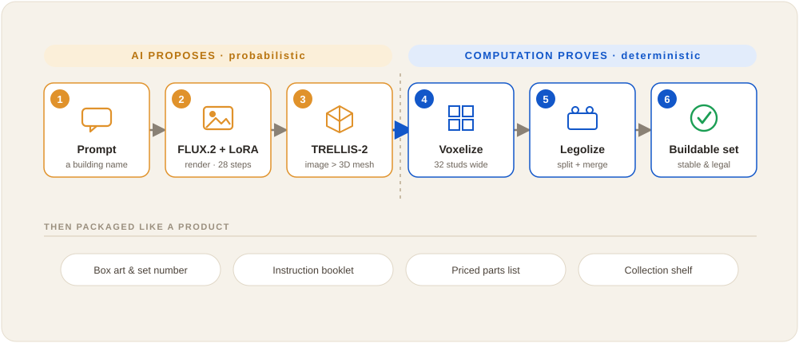
*The whole pipeline at a glance. The left three boxes are generative and probabilistic (they invent the form); the right three are deterministic (they prove it stands). The handoff in the middle is the entire idea.*

## The gap we set out to close

A prior MaCAD project ("LEGO Set: A Generative AI Approach," 2023/24) produced images and marketing copy only: no 3D, no parts, nothing you could build. It was a great picture of a set. It was not a set. We admired it, and we wanted to know what was on the other side of that picture.

That gap is our project. Images are not buildings; renders are not sets. The interesting, unsolved work lives downstream of the pretty picture, so we moved the centre of gravity there:

> text prompt > FLUX render > TRELLIS 3D mesh > voxelize > legolize > a priced, buildable, catalog-legal set.

Each box teaches a different idea about how generative AI and plain computation work, and why you need both. The front half dreams; the back half checks the dream against reality. Walk it with us.

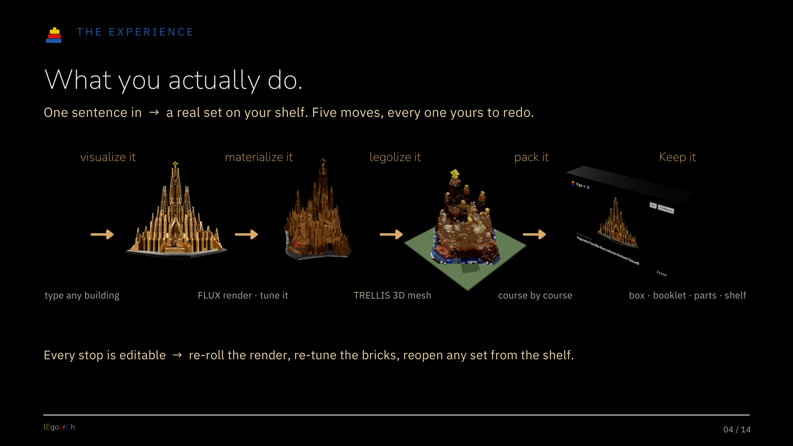
*What you actually do: one sentence in, then five moves, every one yours to redo. Re-roll the render, re-tune the bricks, reopen any set from the shelf.*

## Words into pixels (diffusion, and a LoRA that speaks LEGO)

You type a building name. If your prompt is short, a small language model (Claude Haiku) first fluffs your two words into a richer description: ochre towers, smooth plastic bricks, official-set studio lighting. Then the real engine fires: **FLUX.2 Klein**, a 4-billion-parameter diffusion model.

Diffusion is gloriously counterintuitive, and worth a paragraph because it is the heart of every text-to-image model. During training the model is shown real images with more and more noise added, over and over, until it has thoroughly learned how to turn any picture into static. Generation runs that process backwards. It starts from a square of pure random noise and, over 28 steps, keeps asking "if this blur were a LEGO Sagrada, what would be slightly less blurry?" Each step peels off a little noise in the direction of the answer. Static resolves into towers. It is sculpture by erosion, except the marble is TV snow.

Two dials steer that erosion. **CFG** (we settled on 5.0) sets how hard the model is pushed toward your prompt versus left to its own instincts: too low and it ignores you, too high and it oversharpens into something brittle. A **negative prompt** lists what to keep out (people, trees, cars, thin spires, antennas) so the render arrives as one clean, chunky mass that the next stage can actually digest.

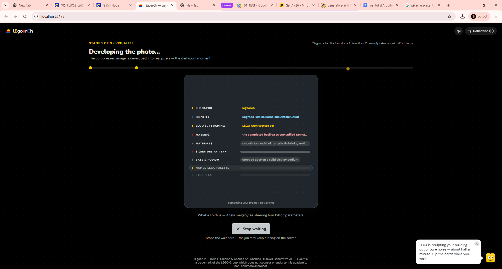
*Developing the photo. Over 28 steps the noise resolves into a studded, beige render. The side note is the honest one-liner: a LoRA is a few megabytes steering four billion parameters.*

Base FLUX does not speak fluent LEGO Architecture, though. Ask it for a LEGO building and you get something vaguely blocky, not the real visual grammar of those sets. So we trained a **LoRA** (a Low-Rank Adaptation). Picture the 4-billion-parameter model as a vast orchestra: retraining the whole thing means hiring a new orchestra, which is wildly expensive, while a LoRA is a tiny conductor (a few megabytes) who learns one genre and nudges the players you already have. Ours learned the look of real LEGO Architecture sets, and we run it at full strength (1.0). We swept the strength from 0 to 1.5 and 1.0 won: below it, the studs and brick seams faded out and the model drifted back toward a generic building. The LEGO-ness genuinely lives in the LoRA, not in the words. Our locked defaults: 28 steps, CFG 5.0, LoRA 1.0, negative prompt on.

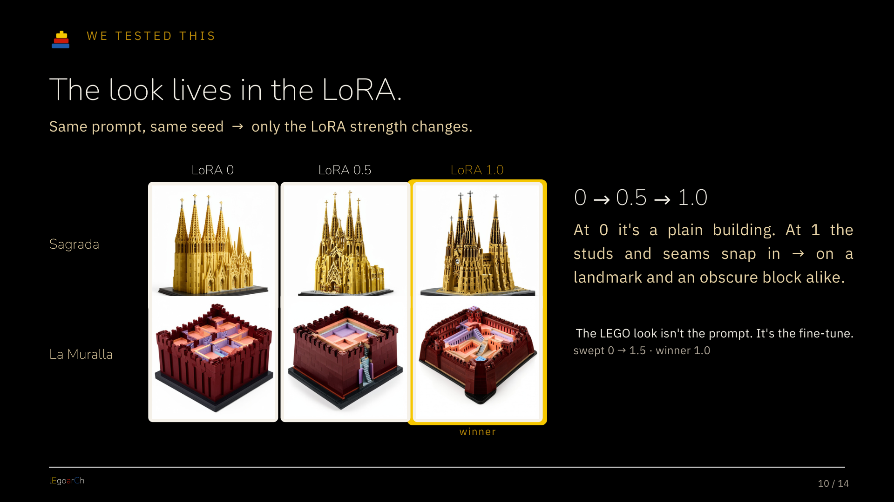
*Same prompt, same seed, only the LoRA strength changes. At 0 it is a plain building; at 1.0 (ringed) the studs and seams snap in, on a landmark and an obscure block alike. The LEGO look is the fine-tune, not the prompt.*

You do not have to start from words, either. The same FLUX.2 plus `legoarch` core runs three ways: text to image, image to image, and image to 3D. Hand it a reference photo of a building you love and it re-renders that photo in the LEGO grammar, keeping the massing while changing the language. Whether you type or upload, the look comes from the same place.

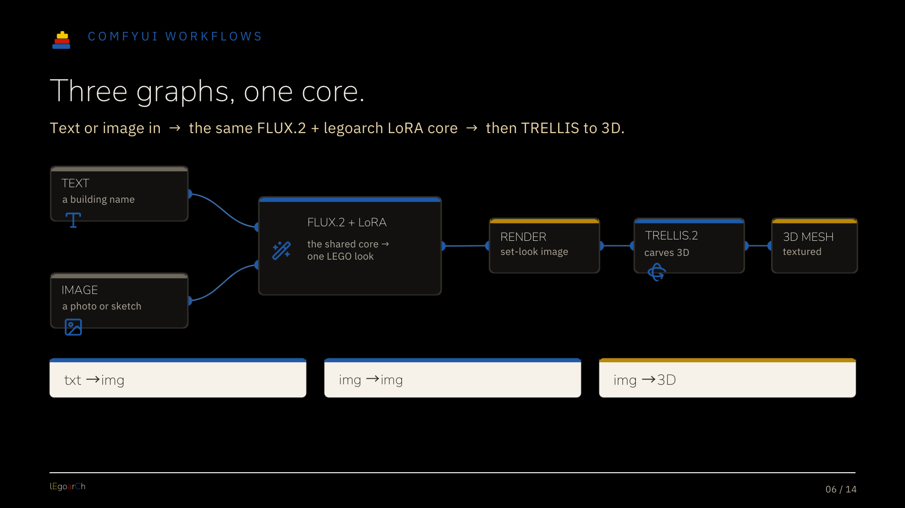
*Three graphs, one core. Text or a photo enters the same FLUX.2 + `legoarch` engine, then TRELLIS carries the result into 3D.*

## One photo into a whole object (TRELLIS)

A render shows one side; a set needs a back. **TRELLIS-2** takes the single FLUX image and hallucinates the full 3D form: a textured mesh whose unseen rear is invented from everything the model knows about how buildings tend to behave. We export it as a mesh of a couple hundred thousand triangles with a 1024-pixel texture wrapped around it.

This is the second creative, probabilistic leap, and it is worth being honest about: TRELLIS is openly guessing the back of the Sagrada. It has never seen it. Mostly it guesses beautifully, completing symmetry and continuing facades in ways that read as right. Sometimes it guesses a blob. Hold that thought; it comes back at the end.

## The Minecraft moment (voxelization)

Here the creative half ends and the deterministic half begins, and the mood of the code changes completely. No more guessing. We chop the smooth mesh into a grid of cubes, the same move that turns a photograph into Minecraft. By default we lay 32 voxels across the building's longest horizontal axis, and you can dial that from 16 (a quick draft) to 64 (a flagship).

One detail we are quietly proud of: LEGO bricks are not cubes. A stud pitch is 8 mm wide but a standard plate is only 3.2 mm tall. Voxelize with true cubes and every layer comes out too tall, so the building looks squashed. So before voxelizing we stretch the mesh vertically by 2.5x, which lands our uniform cubes exactly on plate-height layers and, as a bonus, triples the vertical resolution. We also sample the colour off the mesh and exposure-match it back to the original render (a per-channel, 65-bin quantile remap), because TRELLIS lighting comes out darker and moodier than FLUX. Skip that step and your beige Sagrada arrives the colour of mud. And we fill the model solid rather than hollow, because a set has to be one connected mass, and solid fill is the cheapest guarantee of that.

## The legolizer: where "buildable" gets earned

This is the computational centrepiece, the part we spent the most nights on, and it contains no AI at all. A grid of coloured cubes is still not a set. A set is made of real, purchasable bricks that clutch together and do not fall over. Turning one into the other is a search-and-optimization problem, and we solve it deterministically: same input, same seed, same set every time.

> A render is a proposal. A connected, supported, catalog-legal brick model is the proof.

**Split and merge.** A naive legolizer fills everything with 1x1 bricks and calls it done; the result is a confetti pile that costs a fortune and is miserable to build. Instead, for each layer the solver runs a greedy search over stud footprints: cover the cubes with the largest legal brick that fits and shares a single colour, then fall back to smaller ones, keeping a 1x1 only as the guaranteed last resort. It runs three passes, full-height bricks first, then plates, then a final pass that swaps fully-exposed plates for smooth tiles so the top surface reads clean. A separate slope pass spots single-course staircases and bevels them with 45-degree slope pieces; as far as we can tell, that slope-aware step is the first open implementation of an idea published in 2019 but never released as code. Throughout, a soft "running-bond" penalty discourages bricks from stacking their seams in one wall-weakening column, exactly the way a real bricklayer offsets the joints. About 12% of controlled, seeded randomness keeps the packing from settling into obvious ruts.

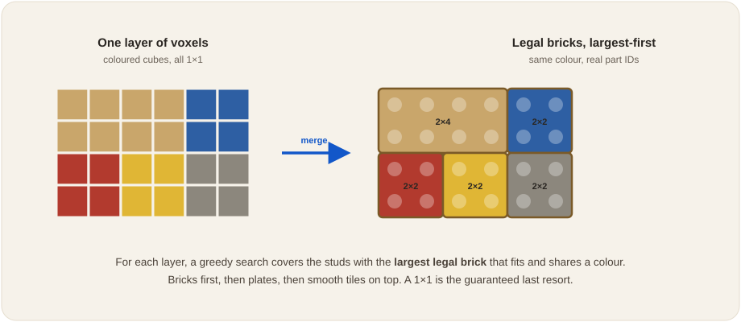
*Split and merge, one layer. The solver tiles a field of coloured cubes with the biggest real bricks that share a colour, instead of a sea of 1x1s.*

Every footprint the solver emits is a real BrickLink part. We built the catalog from Rebrickable's database and cross-checked every entry against LDraw's `LDConfig.ldr`, accepting a colour only when both sources agreed (which caught some genuinely sneaky mismatches, like two different greens both filed under "Olive Green"). The result: 48 colours, 44 parts, and 1,598 validated part-and-colour combinations. This is the third leg of the thesis. Buildable does not only mean it stands up; it means you can put every single piece in a cart.

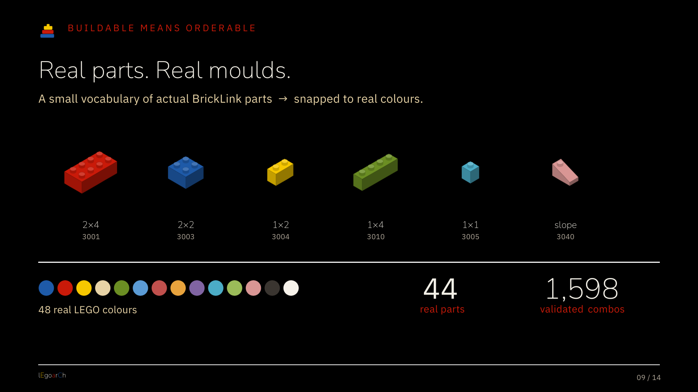
*The solver's whole vocabulary is real moulds. 44 parts and 48 colours give 1,598 validated part-and-colour combinations, every one a thing you can actually put in a cart.*

**Colour with CIEDE2000.** Which of those 48 colours does each brick become? The naive answer, "nearest colour in RGB," is wrong, and wrong in a way worth understanding. RGB distance treats every channel as equal and linear, so it will happily rate a green-to-grey shift as "closer" than a green-to-slightly-different-green, even though your eye screams at the first and shrugs at the second. Human colour vision simply is not uniform. So we convert each colour from sRGB into CIE-Lab (a space built around perception, normalized to the D65 daylight white point) and measure distance with **CIEDE2000**, the international standard for *perceptual* colour difference, with its careful corrections for how we weight lightness, chroma, and hue. Then we snap each brick to the nearest real LEGO colour, with a small tolerance that lets neighbouring bricks merge when they are perceptually the same. It is the difference between "mathematically closest" and "looks right," and matching to a fixed, real palette is exactly where that difference bites.

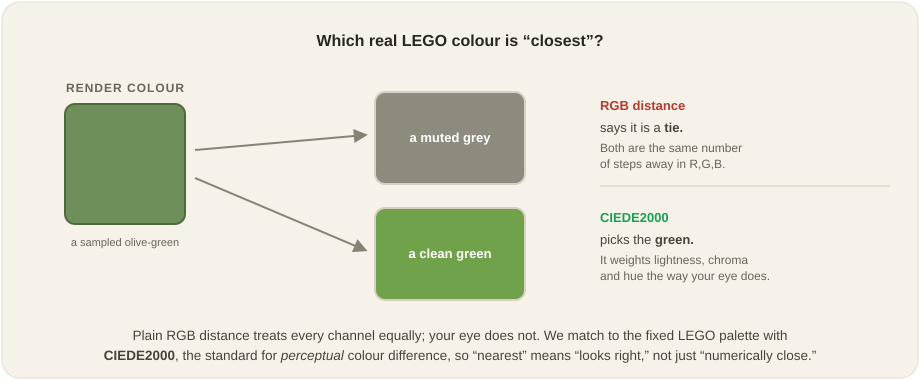
*Why RGB fails. Two palette colours can sit the same numeric distance from a target yet look nothing alike. CIEDE2000 matches the way the eye actually sees.*

**The gravity check.** Finally we prove the thing stands, deterministically. A flood-fill over the six face-neighbours of every brick confirms the model is a single connected mass and not a handful of islands. A support pass then checks that every brick above the baseplate has something beneath it, and reports a support ratio. Where the solver finds a floating fragment, a repair step threads in hidden support pillars automatically, 1x1 by 1x1, until everything is grounded. That support ratio is our honesty number, and we print it on every build rather than hide it.

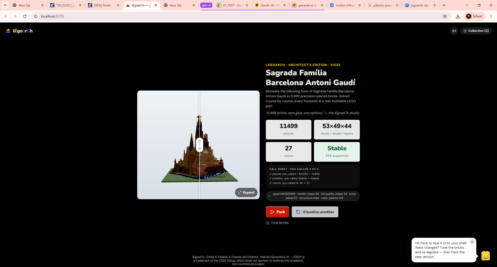
*The money shot. Drag the slider: left is the smooth TRELLIS mesh, right is 11,499 real bricks, 53x49x44 studs, 27 colours, and a green "Stable" badge that means the connectivity and support checks passed.*

## Proof it is real: numbers, then product

We benchmarked on three buildings chosen to span the method: the Sagrada Família and La Muralla Roja (fused, blocky, colourful), and the Guggenheim Bilbao (smooth, curved, the deliberate hard case).

The colour-denoising pass earns its keep. TRELLIS leaves a fine speckle of stray colour that, quantized directly, shatters the model into thousands of single-stud pieces. A gentle blur that pulls each speck toward its local dominant colour, applied before quantization, cut piece counts by 19% to 46% with no loss of connectivity or support: Sagrada fell from 8,627 to 4,682 pieces, Bilbao from 8,168 to 5,830, La Muralla from 9,043 to 7,343. The detail dial scales about quadratically: roughly 2 to 3.5k pieces for a quick draft, 4.7 to 7.3k for the buildable default, 15 to 22k for a flagship.

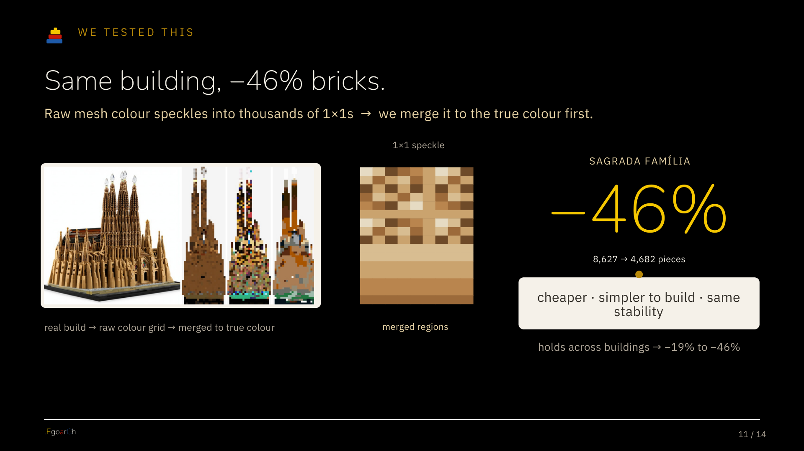
*The denoise pays off. Raw mesh colour speckles into thousands of 1x1s; merging to the true colour first drops the same Sagrada Família from 8,627 to 4,682 pieces, a 46% cut, at the same stability.*

We also resisted a tempting headline. An early draft boasted a 73% piece reduction from switching hollow shells to solid fill, but that number only appeared on one pathological, disconnected mesh that none of the three real buildings produce, so we cut it. The honest buildability story is robustness, not a flashy reduction, and robustness is what the seeds show: re-run a building on a new random seed and the piece count changes (a different seed is a genuinely different generation), but both runs come out connected, around 0.9 to 1.0 supported, and recognizable.

> The right invariant is buildability, not piece count.

Then the part that makes it feel like a product. Every solved set gets box art, a set number, and a back-of-box blurb (that copy is itself written by a language model in a dry, official-catalogue voice), a step-by-step instruction booklet, and a priced parts list. The price is a deterministic estimate built from per-part used-market values times quantity, with a deep link out to BrickLink so you can go price the real thing; we even estimate what the set would resell for. None of it is live market data, and we are careful to call it an estimate, but it turns the buildable fantasy into a number.

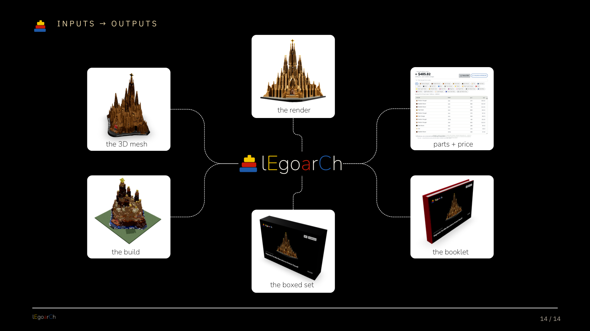
*One sentence in, a whole product out: the render, the 3D mesh, the brick build, a boxed set, an instruction booklet, and a costed parts list ($485.82 for this Sagrada). Every stop is editable, so you can re-roll any of it.*

Keep the ones you like. They line up on a shelf you can spin in 3D, or read back as a list with names and prices: a little gallery of buildable buildings.

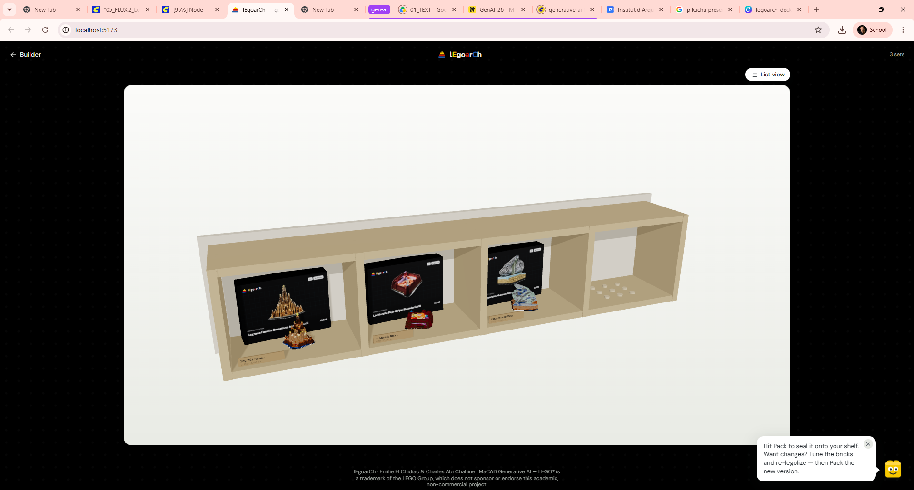
*The shelf, in 3D. Saved sets become a collection you can rotate and revisit.*

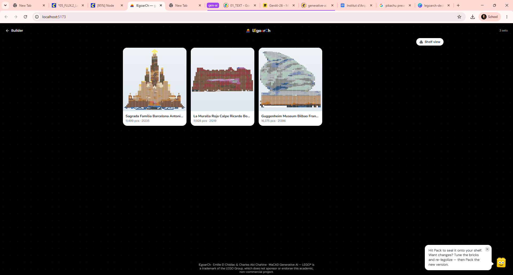
*The same shelf as a list: Sagrada, La Muralla, and the Bilbao blob, each with its piece count and price.*

## Where the method ends (honestly)

We kept Bilbao in the benchmark on purpose, and it fails, gracefully. Its build comes out as a connected, 93%-supported metallic mass with a green atrium stripe: recognizable as a blob, not as Bilbao. That is not a bug we hid. It is the predicted boundary of the whole approach. We even kept the prompt verbatim, full of "swirling titanium-clad volumes" and "continuous curved masses," and the model followed those curves faithfully; a cubic voxel grid simply cannot hold them. Smooth, curvature-dominated forms lose their legibility long before they lose their structure. Voxels love a fused, blocky mass (Sagrada, Muralla) and mangle a Gehry swoop. Showing the failure is how we prove we understand the method, not just where it shines but where it stops.

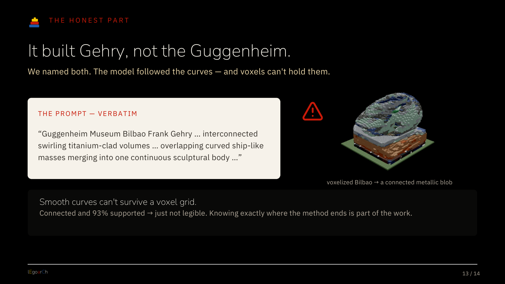
*We named the building and the model followed Gehry's curves... which a voxel grid cannot hold. The result is connected and 93% supported, just not legible. Knowing exactly where the method ends is part of the work.*

## Why this matters

The real tension in lEgoarCh is not AI versus humans. It is probabilistic versus provable. The generative half is creative, surprising, and occasionally wrong: it proposes. The computational half is deterministic, checkable, and never lies about gravity: it proves. Diffusion dreams up a form; CIEDE2000 and a connectivity flood-fill drag that dream into a set you could order tonight and build on your floor.

We think that handoff is the interesting frontier for generative tools in design generally. The inspired gesture is cheap now; anyone can generate a thousand renders before lunch. The value has moved to the layer that takes a gesture and proves it: that it fits the parts that exist, the colours you can buy, the loads it has to carry. We just made that layer literal, one brick at a time.

Type a building. Watch a sentence become a set.

---

*lEgoarCh was built by **Emilie El Chidiac** & **Charles Abi Chahine** for the Generative AI seminar of MaCAD (Master in Advanced Computation for Architecture & Design) at IAAC, the Institute for Advanced Architecture of Catalonia.*

> LEGO® is a trademark of the LEGO Group of companies, which does not sponsor, authorize or endorse this project. This is a non-commercial, academic project; it avoids the LEGO logo, the minifigure, and the trademarked 2×4 brick silhouette, and uses "LEGO" only descriptively (e.g. "built of LEGO bricks").
